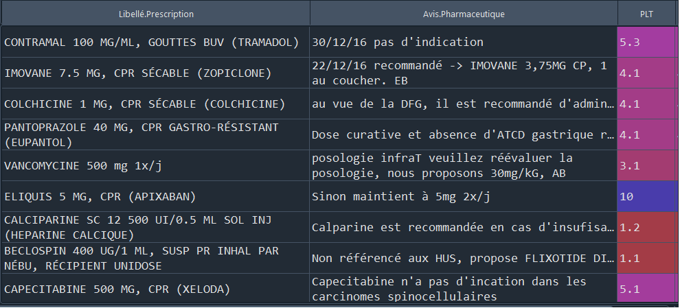
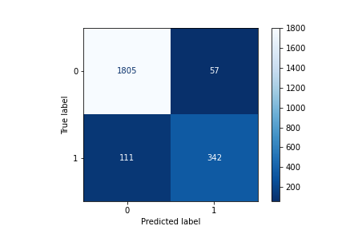
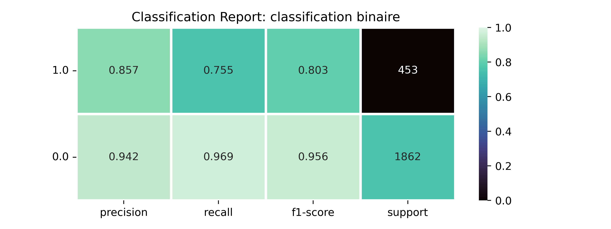
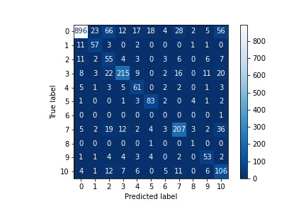
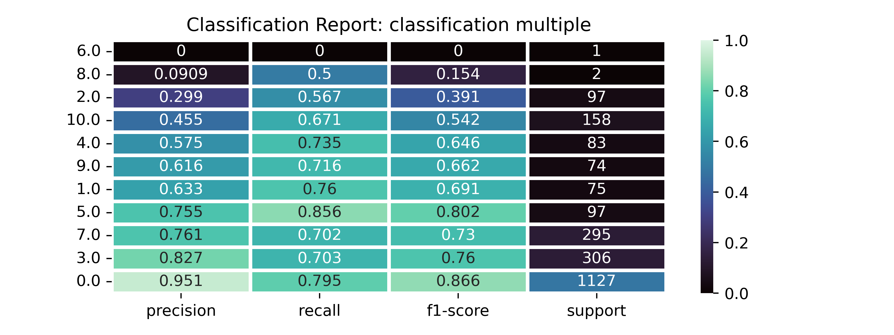

## Classifications des avis pharmaceutiques concernant d'éventuelles erreurs de prescriptions médicales Implémentation avec Tensorflow

Dans ce projet, on dispose d'une base de données tabulaires dans un fichier `.csv`. Cette base de données est constituée de trois colonnes: les libellés de prescriptions, les avis pharmaceutiques et les etiquettes associées aux différents avis.
L'objectif de ce travail est de faire la classification les avis pharmaceutiques, qui sont initialement du texte. On utilisera un modèle de réseau de neurones profonds qu'on entrainera sur le corpus `avis pharmaceutiques` afin de prédire à quelles classes
chaque avis appartient. Dans un premier temps, on fera la classification binaire; Ensuite, on fera la classification multiple.

On peut imaginer un tel projet dans un environnement réel de production comme une pharmacie, en tant qu'un outil d'aide aux personnels en pharmacie. Dans un tel environnement, un tel programme signalerait automatiquement un éventuel problème de prescription
médicamenteuse. Toutefois, ce projet se limite juste à la tache de classification.

## Avertissement et Recommandations

Ce projet contient 3 fichiers de classification, dont deux pour la classification binaire (`text_classif.py` et `text_classif2.py`) avec des stratégie de prétraitement différent, et un fichier pour la classification multiple (`multi_classif.py`).
Le clonage et l'exécution de ce repos ne fonctionnera pas, car les données ne sont pas fournies avec le code. Toutefois, vous pouvez construire votre propre base de données et l'ajouter au répertoire pour faire des tests et adaptations.
Ci-dessous, un apercu du fichiers `.csv`.
<a href="./graphics/apercu_df.png"></img></a>

## Préparation des données.

le fichier [preprocesser.py] situé dans le module `modules` contient des fonctions nécessaires pour le prétraitement. Selon le type de classification (binaire ou multiple), les opérations classiques ont été réalisées:
- tokénisation, retrait des mots vides, transformation des documents en séquences tokenisées, transformations des majuscules, grâce à la bibliothèque gensim.
  le corpus ici présent en français. La liste des mots vides intégrés à gensim n'est donc pas utile, car son vocabulaire est en anglais. Il a fallu ajouter une opération supplémentaire de filtration des mots vides;
- le recodage des etiquettes;
- la suppression des lignes de avec valeurs manquantes.

L'analyse de la distribution des données par classe montre un déséquilibre des classes comme le montre les figures ci-dessous:
<a href="./graphics/distribution_classifBinaire.png"></img></a>
<a href="./graphics/distribution_multiclasse.png"></img></a>
Il a été proposé une méthode d'augmentation des données de la classe minoritaire, en synthétisant des tokens sémantiquement proches, des token existant dans des séquences de la classe d'intérêt. Pour ce faire, on s'est servi 
d'un dictionaire provenant d'un dictionnaire préentrainé sur des corpus en francais. Le code de cette augmentation de données est présent dans le fichiers `sampler.py`. Pour cela, il faudra aussi télécharger le modèle binaire
nommé `frWac_non_lem_no_postag_no_phrase_200_skip_cut100.bin` et le sauvegarder dans le dossier `modules`. Si vous voulez expérimenter d'autres modèles préentrainés pour réaliser l'opération d'augmentation des données, vous pouvez choisir
un autre fichier, présent sur le site https://fauconnier.github.io/#data.

- la vectorisation du texte. On a utilisé deux methodes: le `word2vec`, ainsi que le `one Hot Encoding. 

## Entrainement des modèles
Deux modèles ont été construits: un CNN (utilisé pour la classification binaire, dans le fichier `text_classif.py`), et un DNN pour la classification multiple.
Les détails de l'architecture des modèles sont présents dans le module `models.py`. Vous pouvez ajouter vos propres modèles et les entrainer.

### classification binaire
Après entrainement du modèle, il a été testé sur les données de test. On obtient les résultats ci-dessous:
<a href="./graphics/cf_binaryClassif.png"></img></a>
Figure de la matrice de confusion pour la classification binaire

<a href="./graphics/clr_binaryClassif.png"></img></a>
Figure du rapport de classification binaire

### classification multiple
Dans le cas de la classification multiple, les résults ci dessous montrent la performance du modèle sur les données de test.

<a href="./graphics/cf_multiClassif.png"></img></a>
Figure de la matrice de confusion pour la classification multiple

<a href="./graphics/clr_multiClassif.png"></img></a>
Figure du rapport de classification multiple

## Pistes d'amélioration pour les passionnés
Le corpus étant en francais, la lémmatisation n'est pas possible avec la bibliothèque nltk qui fait juste la stematisation sur les corpus en français. Il est conseillé de faire cette opération de lemmatisation, à l'aide de la bibliothèque SpaCy.
Ainsi, le dictionnaire qui permettra de procéder à la vectorisation du texte sera plus réduit, ce qui pourrait améliorer les performances des modèles.
Si vous optez pour l'augmentation des données de la classe minoritaire, il faut tester d'autres modèles binaires sur le site indiqué plus haut qui ont aurait un dictionnaire beaucoup plus grand / plus riche, mais beaucoup plus lourd (chaque médaille a son revers `:"(`)

### Auteur
Samuel Fabrice NCHARE